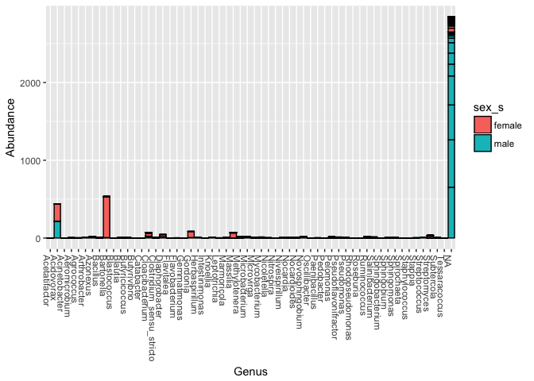

Analysis Report 1: Diversity of Microbial Communities Among Females and Males
================
Chelsea Noack
October 30, 2017

Introduction
============

Microbial communities are groups of microorganisms inhabiting the same place. These communities span from sizes of large to small. Pairwise interactions between different species within the community predict the microbial community. As bacterial species interact with one another, they in turn affect the health of their host. In a human host, microbes can live in various places on the body, from the gut to the palm of a hand. As humans, we can learn a lot from these communities.

Skin-associated microbial communities are diverse and personalized. The diversity is due to, first, the skin being a multi-layered organ. Second, each layer has different structures, ranging from arm hair follicles to glands. The different structures operate as sub-habitats for microbes. Third, the skin has various niches a microbe can inhabit. The niches themselves range from pH to moisture levels. The above all attribute to the diversity of skin-associate microbial communities.

The microbial communities found on human skin are also personalized, which raises a lot of questions. By knowing the makeup of one's microbial community, what can we learn about the individual? Further, what can learn about a community whom all share similar microbial communities? What can we learn about the perceived differences? Specifically, can something such as sex be an indicator for microbial community difference? I hypothesize that females and males have different microbial communities. In my analysis, I will attempt to answer this question using the data from a study done by Fierer et al. (2010). In the study, Fierer et al. took samples from personal computers and the computer owner's palm. By studying the similarities between the samples, Fierer et al. hypothesized that one can identify the computer by its owner using microbial communities (Fierer *et al.*, 2010). Given the data, I will attempt to answer my biological question about the relationship between gender and microbes.

Methods
=======

Sample origin and sequencing
----------------------------

Nine women and men of equivalent age and health (four women, five men) served as subjects for the computer mouse study. All subjects worked in the same building at the University of Colorado. The computer mouses all belonged to one individual. Every individual touched their computer mouse in the last 12 hours. Before sampling, all individuals practiced their regular hygiene routines. Fierer et al. used an MO BIO Powersoil isolation kit in order to extract DNA from the individuals. The extractions were essentially swabbing the palm.

Next, they amplified the 16SrRNA genes from every sample. They did this by using a primer set then running it through PCR. 16SrRNA is a common genetic marker used for sequencing. It's often used because it is present in nearly all bacteria and it is large enough for our informatics purposes (Janda and Abbott (2007)). Finally, Fierer et al. sequenced the DNA of each sample. The method of choice was pyrosequencing using a 454 Life Sciences Genome Sequencer FLX Instrument (Roche). Pyrosequencing is a type of sequencing that follows the "sequencing by synthesis" model. If after sequencing they were less than 200 or more than 300 base pairs in length, Fierer et al. excluded the sequences.

Finally, they compared the DNA from the nine individuals to DNA swabs from 270 other healthy hands ranging from 18-40 years old.

Computational
-------------

First, Fierer et al. obtained the sequences from the RDP database, which is open for the public. We downloaded the files to a raw data directory.

A package called DADA2 (Callahan *et al.*, 2016) needed to be installed. The package came from a bioconductor which serves as the primary package to clean up and analyze our data. We also downloaded another package called phyloseq (McMurdie and Holmes, 2013). Once DADA2 and phyloseq downloaded, we used DADA2 to extract sample names from their original .fastq names. We also ensured our samples were in order. When all files were downloaded and organized, we did a QC (quality check) report on each individual file.

QC reports help us see how viable each sequence is for analysis. If the majority of the sequence is above a 30 score, then we consider it to be sequenced well. Typically, the 3' end will deteriorate, which is normal. After the quality check, all filtered files (no files exceeding 225 because quality of bases deteriorate around approximately 200 bp) were placed in one file. Finally, the filtered files were trimmed down using DADA2's recommended 454 parameters, as Fierer et al. used 454 pyrosequencing (Roche). Once the files were trimmed, they are ready to be analyzed.

Results
=======

``` r
# Plots the quality profiles of all twenty samples
plotQualityProfile(filenames_forward_reads[1:20])
```


**Quality check**: The quality profiles show that most reads tend to decline in quality after 200 bases. Given the deterioration, we decided to set a maximum acceptable sequence length of 225 bases. Overall however, QC was good. A common, albeit unsurprising, pattern was a degradation as the sequences got closer to the 3' end. Yet the degree in which the sequences degraded varied.

For example: In sequence ERR1942280, we see that the mean quality of scores for the bases were approximately 36, which is a well-above average score. In other scores such as ERR1942282, the average was 35. While both sequences achieved a great sequence score, visually they look quite different. In reality, most of the sequences provided by Fierer et al. are above 30 and thus very good.

|                  |  Reads In|  Reads Out|
|------------------|---------:|----------:|
| ERR1942280.fastq |       404|        350|
| ERR1942281.fastq |       422|        194|
| ERR1942282.fastq |       412|         31|
| ERR1942283.fastq |       791|        426|
| ERR1942284.fastq |       677|        525|
| ERR1942285.fastq |       443|         72|
| ERR1942286.fastq |       667|        617|
| ERR1942287.fastq |       590|        541|
| ERR1942288.fastq |       908|        877|
| ERR1942289.fastq |       372|        147|
| ERR1942290.fastq |       468|        249|
| ERR1942291.fastq |       933|        819|
| ERR1942292.fastq |       724|        709|
| ERR1942293.fastq |       811|        470|
| ERR1942294.fastq |       938|        552|
| ERR1942295.fastq |       705|        620|
| ERR1942296.fastq |       754|        441|
| ERR1942297.fastq |       275|        246|
| ERR1942298.fastq |       562|        389|
| ERR1942299.fastq |      1025|        852|

    ## Not all sequences were the same length.
    ## Not all sequences were the same length.
    ## Not all sequences were the same length.
    ## Not all sequences were the same length.
    ## Not all sequences were the same length.
    ## Not all sequences were the same length.
    ## Not all sequences were the same length.
    ## Not all sequences were the same length.
    ## Not all sequences were the same length.
    ## Not all sequences were the same length.
    ## Not all sequences were the same length.
    ## Not all sequences were the same length.
    ## Not all sequences were the same length.
    ## Not all sequences were the same length.
    ## Not all sequences were the same length.
    ## Not all sequences were the same length.
    ## Not all sequences were the same length.
    ## Not all sequences were the same length.
    ## Not all sequences were the same length.
    ## Not all sequences were the same length.
    ## Initializing error rates to maximum possible estimate.
    ## Sample 1 - 350 reads in 72 unique sequences.
    ## Sample 2 - 194 reads in 163 unique sequences.
    ## Sample 3 - 31 reads in 25 unique sequences.
    ## Sample 4 - 426 reads in 176 unique sequences.
    ## Sample 5 - 525 reads in 134 unique sequences.
    ## Sample 6 - 72 reads in 65 unique sequences.
    ## Sample 7 - 617 reads in 178 unique sequences.
    ## Sample 8 - 541 reads in 135 unique sequences.
    ## Sample 9 - 877 reads in 201 unique sequences.
    ## Sample 10 - 147 reads in 107 unique sequences.
    ## Sample 11 - 249 reads in 181 unique sequences.
    ## Sample 12 - 819 reads in 212 unique sequences.
    ## Sample 13 - 709 reads in 128 unique sequences.
    ## Sample 14 - 470 reads in 171 unique sequences.
    ## Sample 15 - 552 reads in 250 unique sequences.
    ## Sample 16 - 620 reads in 141 unique sequences.
    ## Sample 17 - 441 reads in 186 unique sequences.
    ## Sample 18 - 246 reads in 88 unique sequences.
    ## Sample 19 - 389 reads in 332 unique sequences.
    ## Sample 20 - 852 reads in 239 unique sequences.
    ##    selfConsist step 2 
    ##    selfConsist step 3 
    ## 
    ## 
    ## Convergence after  3  rounds.
    ## Total reads used:  9127

``` r
# quick check to see if error models match data
# (black lines match black points) and are generally decresing left to right
plotErrors(errors_forward_reads,
           nominalQ = TRUE)
```

    ## Warning: Transformation introduced infinite values in continuous y-axis

    ## Warning: Transformation introduced infinite values in continuous y-axis


**Errors** Not all sequences were the same length, which I expected. Every sample had plenty of errors per sequence for both females and males. Generally, you want the black line to follow the black points and, as expected, they generally decrease to the left. In terms of errors, outliers were rare, again indicating the sequencing was well done.

    ## Dereplicating sequence entries in Fastq file: output/filtered/ERR1942280_filt.fastq.gz

    ## Encountered 72 unique sequences from 350 total sequences read.

    ## Not all sequences were the same length.

    ## Dereplicating sequence entries in Fastq file: output/filtered/ERR1942281_filt.fastq.gz

    ## Encountered 163 unique sequences from 194 total sequences read.

    ## Not all sequences were the same length.

    ## Dereplicating sequence entries in Fastq file: output/filtered/ERR1942282_filt.fastq.gz

    ## Encountered 25 unique sequences from 31 total sequences read.

    ## Not all sequences were the same length.

    ## Dereplicating sequence entries in Fastq file: output/filtered/ERR1942283_filt.fastq.gz

    ## Encountered 176 unique sequences from 426 total sequences read.

    ## Not all sequences were the same length.

    ## Dereplicating sequence entries in Fastq file: output/filtered/ERR1942284_filt.fastq.gz

    ## Encountered 134 unique sequences from 525 total sequences read.

    ## Not all sequences were the same length.

    ## Dereplicating sequence entries in Fastq file: output/filtered/ERR1942285_filt.fastq.gz

    ## Encountered 65 unique sequences from 72 total sequences read.

    ## Not all sequences were the same length.

    ## Dereplicating sequence entries in Fastq file: output/filtered/ERR1942286_filt.fastq.gz

    ## Encountered 178 unique sequences from 617 total sequences read.

    ## Not all sequences were the same length.

    ## Dereplicating sequence entries in Fastq file: output/filtered/ERR1942287_filt.fastq.gz

    ## Encountered 135 unique sequences from 541 total sequences read.

    ## Not all sequences were the same length.

    ## Dereplicating sequence entries in Fastq file: output/filtered/ERR1942288_filt.fastq.gz

    ## Encountered 201 unique sequences from 877 total sequences read.

    ## Not all sequences were the same length.

    ## Dereplicating sequence entries in Fastq file: output/filtered/ERR1942289_filt.fastq.gz

    ## Encountered 107 unique sequences from 147 total sequences read.

    ## Not all sequences were the same length.

    ## Dereplicating sequence entries in Fastq file: output/filtered/ERR1942290_filt.fastq.gz

    ## Encountered 181 unique sequences from 249 total sequences read.

    ## Not all sequences were the same length.

    ## Dereplicating sequence entries in Fastq file: output/filtered/ERR1942291_filt.fastq.gz

    ## Encountered 212 unique sequences from 819 total sequences read.

    ## Not all sequences were the same length.

    ## Dereplicating sequence entries in Fastq file: output/filtered/ERR1942292_filt.fastq.gz

    ## Encountered 128 unique sequences from 709 total sequences read.

    ## Not all sequences were the same length.

    ## Dereplicating sequence entries in Fastq file: output/filtered/ERR1942293_filt.fastq.gz

    ## Encountered 171 unique sequences from 470 total sequences read.

    ## Not all sequences were the same length.

    ## Dereplicating sequence entries in Fastq file: output/filtered/ERR1942294_filt.fastq.gz

    ## Encountered 250 unique sequences from 552 total sequences read.

    ## Not all sequences were the same length.

    ## Dereplicating sequence entries in Fastq file: output/filtered/ERR1942295_filt.fastq.gz

    ## Encountered 141 unique sequences from 620 total sequences read.

    ## Not all sequences were the same length.

    ## Dereplicating sequence entries in Fastq file: output/filtered/ERR1942296_filt.fastq.gz

    ## Encountered 186 unique sequences from 441 total sequences read.

    ## Not all sequences were the same length.

    ## Dereplicating sequence entries in Fastq file: output/filtered/ERR1942297_filt.fastq.gz

    ## Encountered 88 unique sequences from 246 total sequences read.

    ## Not all sequences were the same length.

    ## Dereplicating sequence entries in Fastq file: output/filtered/ERR1942298_filt.fastq.gz

    ## Encountered 332 unique sequences from 389 total sequences read.

    ## Not all sequences were the same length.

    ## Dereplicating sequence entries in Fastq file: output/filtered/ERR1942299_filt.fastq.gz

    ## Encountered 239 unique sequences from 852 total sequences read.

    ## Not all sequences were the same length.

    ## Sample 1 - 350 reads in 72 unique sequences.
    ## Sample 2 - 194 reads in 163 unique sequences.
    ## Sample 3 - 31 reads in 25 unique sequences.
    ## Sample 4 - 426 reads in 176 unique sequences.
    ## Sample 5 - 525 reads in 134 unique sequences.
    ## Sample 6 - 72 reads in 65 unique sequences.
    ## Sample 7 - 617 reads in 178 unique sequences.
    ## Sample 8 - 541 reads in 135 unique sequences.
    ## Sample 9 - 877 reads in 201 unique sequences.
    ## Sample 10 - 147 reads in 107 unique sequences.
    ## Sample 11 - 249 reads in 181 unique sequences.
    ## Sample 12 - 819 reads in 212 unique sequences.
    ## Sample 13 - 709 reads in 128 unique sequences.
    ## Sample 14 - 470 reads in 171 unique sequences.
    ## Sample 15 - 552 reads in 250 unique sequences.
    ## Sample 16 - 620 reads in 141 unique sequences.
    ## Sample 17 - 441 reads in 186 unique sequences.
    ## Sample 18 - 246 reads in 88 unique sequences.
    ## Sample 19 - 389 reads in 332 unique sequences.
    ## Sample 20 - 852 reads in 239 unique sequences.

    ## $ERR1942280
    ## dada-class: object describing DADA2 denoising results
    ## 3 sample sequences were inferred from 72 input unique sequences.
    ## Key parameters: OMEGA_A = 1e-40, BAND_SIZE = 32, USE_QUALS = TRUE
    ## 
    ## $ERR1942281
    ## dada-class: object describing DADA2 denoising results
    ## 18 sample sequences were inferred from 163 input unique sequences.
    ## Key parameters: OMEGA_A = 1e-40, BAND_SIZE = 32, USE_QUALS = TRUE
    ## 
    ## $ERR1942282
    ## dada-class: object describing DADA2 denoising results
    ## 3 sample sequences were inferred from 25 input unique sequences.
    ## Key parameters: OMEGA_A = 1e-40, BAND_SIZE = 32, USE_QUALS = TRUE
    ## 
    ## $ERR1942283
    ## dada-class: object describing DADA2 denoising results
    ## 17 sample sequences were inferred from 176 input unique sequences.
    ## Key parameters: OMEGA_A = 1e-40, BAND_SIZE = 32, USE_QUALS = TRUE
    ## 
    ## $ERR1942284
    ## dada-class: object describing DADA2 denoising results
    ## 4 sample sequences were inferred from 134 input unique sequences.
    ## Key parameters: OMEGA_A = 1e-40, BAND_SIZE = 32, USE_QUALS = TRUE
    ## 
    ## $ERR1942285
    ## dada-class: object describing DADA2 denoising results
    ## 7 sample sequences were inferred from 65 input unique sequences.
    ## Key parameters: OMEGA_A = 1e-40, BAND_SIZE = 32, USE_QUALS = TRUE
    ## 
    ## $ERR1942286
    ## dada-class: object describing DADA2 denoising results
    ## 8 sample sequences were inferred from 178 input unique sequences.
    ## Key parameters: OMEGA_A = 1e-40, BAND_SIZE = 32, USE_QUALS = TRUE
    ## 
    ## $ERR1942287
    ## dada-class: object describing DADA2 denoising results
    ## 5 sample sequences were inferred from 135 input unique sequences.
    ## Key parameters: OMEGA_A = 1e-40, BAND_SIZE = 32, USE_QUALS = TRUE
    ## 
    ## $ERR1942288
    ## dada-class: object describing DADA2 denoising results
    ## 5 sample sequences were inferred from 201 input unique sequences.
    ## Key parameters: OMEGA_A = 1e-40, BAND_SIZE = 32, USE_QUALS = TRUE
    ## 
    ## $ERR1942289
    ## dada-class: object describing DADA2 denoising results
    ## 17 sample sequences were inferred from 107 input unique sequences.
    ## Key parameters: OMEGA_A = 1e-40, BAND_SIZE = 32, USE_QUALS = TRUE
    ## 
    ## $ERR1942290
    ## dada-class: object describing DADA2 denoising results
    ## 13 sample sequences were inferred from 181 input unique sequences.
    ## Key parameters: OMEGA_A = 1e-40, BAND_SIZE = 32, USE_QUALS = TRUE
    ## 
    ## $ERR1942291
    ## dada-class: object describing DADA2 denoising results
    ## 8 sample sequences were inferred from 212 input unique sequences.
    ## Key parameters: OMEGA_A = 1e-40, BAND_SIZE = 32, USE_QUALS = TRUE
    ## 
    ## $ERR1942292
    ## dada-class: object describing DADA2 denoising results
    ## 3 sample sequences were inferred from 128 input unique sequences.
    ## Key parameters: OMEGA_A = 1e-40, BAND_SIZE = 32, USE_QUALS = TRUE
    ## 
    ## $ERR1942293
    ## dada-class: object describing DADA2 denoising results
    ## 11 sample sequences were inferred from 171 input unique sequences.
    ## Key parameters: OMEGA_A = 1e-40, BAND_SIZE = 32, USE_QUALS = TRUE
    ## 
    ## $ERR1942294
    ## dada-class: object describing DADA2 denoising results
    ## 30 sample sequences were inferred from 250 input unique sequences.
    ## Key parameters: OMEGA_A = 1e-40, BAND_SIZE = 32, USE_QUALS = TRUE
    ## 
    ## $ERR1942295
    ## dada-class: object describing DADA2 denoising results
    ## 4 sample sequences were inferred from 141 input unique sequences.
    ## Key parameters: OMEGA_A = 1e-40, BAND_SIZE = 32, USE_QUALS = TRUE
    ## 
    ## $ERR1942296
    ## dada-class: object describing DADA2 denoising results
    ## 17 sample sequences were inferred from 186 input unique sequences.
    ## Key parameters: OMEGA_A = 1e-40, BAND_SIZE = 32, USE_QUALS = TRUE
    ## 
    ## $ERR1942297
    ## dada-class: object describing DADA2 denoising results
    ## 5 sample sequences were inferred from 88 input unique sequences.
    ## Key parameters: OMEGA_A = 1e-40, BAND_SIZE = 32, USE_QUALS = TRUE
    ## 
    ## $ERR1942298
    ## dada-class: object describing DADA2 denoising results
    ## 21 sample sequences were inferred from 332 input unique sequences.
    ## Key parameters: OMEGA_A = 1e-40, BAND_SIZE = 32, USE_QUALS = TRUE
    ## 
    ## $ERR1942299
    ## dada-class: object describing DADA2 denoising results
    ## 8 sample sequences were inferred from 239 input unique sequences.
    ## Key parameters: OMEGA_A = 1e-40, BAND_SIZE = 32, USE_QUALS = TRUE

    ## The sequences being tabled vary in length.

``` r
# Quick check to look at distribution of trimmed and denoised sequences
hist(nchar(getSequences(sequence_table)),
     main = "Histogram of fingal sequence variant lengths",
     xlab = "Sequence length in bp")
```


**Histogram of sequence lengths**: After trimming in DADA2 and denoising, the histogram shows a strong skew to the right with most sequences were around 220-225 bp. The lower range of sequences were below 220 bp.

``` r
# Check for and remove chimeras
sequence_table_nochim <- removeBimeraDenovo(sequence_table,
                                            method = "consensus",
                                            multithread = FALSE,
                                            verbose = TRUE)
```

    ## Identified 2 bimeras out of 178 input sequences.

``` r
# What percent of our reads are non-chimeric?
non_chimeric_reads <- round(sum(sequence_table_nochim) / sum(sequence_table),
                            digits = 4) * 100
```

**Chimera Removal**: After removing chimeras, we have 99.65% of our cleaned reads. We use a table because we want to do variant analysis methods and DADA2 does not cluster things. The alternative, OTU, is more error-prone. The table will show all unique sequences in a sample while avoiding clustering.

We see 176 sequences in each column with 20 samples in the rows. 5 samples (84, 86, 93, 95, 99) shared one sequence. This is due to the experimenters parameters. When looking at the taxa, we see that sequence is match to an unnamed Proteobacteria, which makes sense as later on we see that the majority of females and males have a type of Proteobacteria.

|            |  Input|  Filtered|  Denoised|  Sequence Table|  Non-chimeric|
|------------|------:|---------:|---------:|---------------:|-------------:|
| ERR1942280 |    404|       350|       350|             350|           350|
| ERR1942281 |    422|       194|       194|             194|           194|
| ERR1942282 |    412|        31|        31|              31|            31|
| ERR1942283 |    791|       426|       426|             426|           426|
| ERR1942284 |    677|       525|       525|             525|           525|
| ERR1942285 |    443|        72|        72|              72|            72|
| ERR1942286 |    667|       617|       617|             617|           585|
| ERR1942287 |    590|       541|       541|             541|           541|
| ERR1942288 |    908|       877|       877|             877|           877|
| ERR1942289 |    372|       147|       147|             147|           147|
| ERR1942290 |    468|       249|       249|             249|           249|
| ERR1942291 |    933|       819|       819|             819|           819|
| ERR1942292 |    724|       709|       709|             709|           709|
| ERR1942293 |    811|       470|       470|             470|           470|
| ERR1942294 |    938|       552|       552|             552|           552|
| ERR1942295 |    705|       620|       620|             620|           620|
| ERR1942296 |    754|       441|       441|             441|           441|
| ERR1942297 |    275|       246|       246|             246|           246|
| ERR1942298 |    562|       389|       389|             389|           389|
| ERR1942299 |   1025|       852|       852|             852|           852|

    ##        [,1]       [,2]                        [,3]                 
    ##   [1,] "Bacteria" "Proteobacteria"            NA                   
    ##   [2,] "Bacteria" "Proteobacteria"            "Alphaproteobacteria"
    ##   [3,] "Bacteria" "Bacteroidetes"             "Cytophagia"         
    ##   [4,] "Bacteria" "Proteobacteria"            NA                   
    ##   [5,] "Bacteria" "Proteobacteria"            "Betaproteobacteria" 
    ##   [6,] "Bacteria" "Cyanobacteria/Chloroplast" "Chloroplast"        
    ##   [7,] "Bacteria" "Proteobacteria"            "Betaproteobacteria" 
    ##   [8,] "Bacteria" "Bacteroidetes"             NA                   
    ##   [9,] "Bacteria" "Proteobacteria"            "Alphaproteobacteria"
    ##  [10,] "Bacteria" "Proteobacteria"            "Betaproteobacteria" 
    ##  [11,] "Bacteria" "Proteobacteria"            NA                   
    ##  [12,] "Bacteria" "Actinobacteria"            "Actinobacteria"     
    ##  [13,] "Bacteria" "Cyanobacteria/Chloroplast" "Chloroplast"        
    ##  [14,] "Bacteria" "Proteobacteria"            "Betaproteobacteria" 
    ##  [15,] "Bacteria" "Proteobacteria"            "Betaproteobacteria" 
    ##  [16,] "Bacteria" "Proteobacteria"            NA                   
    ##  [17,] "Bacteria" "Bacteroidetes"             "Flavobacteriia"     
    ##  [18,] "Bacteria" "Firmicutes"                "Clostridia"         
    ##  [19,] "Bacteria" NA                          NA                   
    ##  [20,] "Bacteria" "Proteobacteria"            "Betaproteobacteria" 
    ##  [21,] "Bacteria" "Firmicutes"                "Clostridia"         
    ##  [22,] "Bacteria" "Firmicutes"                "Clostridia"         
    ##  [23,] "Bacteria" "Firmicutes"                "Clostridia"         
    ##  [24,] "Bacteria" "Firmicutes"                "Clostridia"         
    ##  [25,] "Bacteria" "Proteobacteria"            "Betaproteobacteria" 
    ##  [26,] "Bacteria" "Cyanobacteria/Chloroplast" "Chloroplast"        
    ##  [27,] "Bacteria" "Firmicutes"                "Clostridia"         
    ##  [28,] "Bacteria" "Actinobacteria"            "Actinobacteria"     
    ##  [29,] "Bacteria" "Firmicutes"                "Clostridia"         
    ##  [30,] "Bacteria" "Proteobacteria"            "Alphaproteobacteria"
    ##  [31,] "Bacteria" "Actinobacteria"            "Actinobacteria"     
    ##  [32,] "Bacteria" "Actinobacteria"            "Actinobacteria"     
    ##  [33,] "Bacteria" "Actinobacteria"            "Actinobacteria"     
    ##  [34,] "Bacteria" "Actinobacteria"            "Actinobacteria"     
    ##  [35,] "Bacteria" "Firmicutes"                "Clostridia"         
    ##  [36,] "Bacteria" "Proteobacteria"            "Betaproteobacteria" 
    ##  [37,] "Bacteria" "Proteobacteria"            "Alphaproteobacteria"
    ##  [38,] "Bacteria" "Actinobacteria"            "Actinobacteria"     
    ##  [39,] "Bacteria" "Cyanobacteria/Chloroplast" "Chloroplast"        
    ##  [40,] "Bacteria" "Bacteroidetes"             "Flavobacteriia"     
    ##  [41,] "Bacteria" "Firmicutes"                "Bacilli"            
    ##  [42,] "Bacteria" "Firmicutes"                "Clostridia"         
    ##  [43,] "Bacteria" "Proteobacteria"            "Betaproteobacteria" 
    ##  [44,] "Bacteria" "Firmicutes"                "Clostridia"         
    ##  [45,] "Bacteria" "Proteobacteria"            "Gammaproteobacteria"
    ##  [46,] "Bacteria" "Actinobacteria"            "Actinobacteria"     
    ##  [47,] "Bacteria" "Firmicutes"                "Clostridia"         
    ##  [48,] "Bacteria" "Proteobacteria"            "Betaproteobacteria" 
    ##  [49,] "Bacteria" "Actinobacteria"            "Actinobacteria"     
    ##  [50,] "Bacteria" "Actinobacteria"            "Actinobacteria"     
    ##  [51,] "Bacteria" "Actinobacteria"            "Actinobacteria"     
    ##  [52,] "Bacteria" "Firmicutes"                "Clostridia"         
    ##  [53,] "Bacteria" "Actinobacteria"            "Actinobacteria"     
    ##  [54,] "Bacteria" "Proteobacteria"            "Alphaproteobacteria"
    ##  [55,] "Bacteria" "Firmicutes"                NA                   
    ##  [56,] "Bacteria" "Actinobacteria"            "Actinobacteria"     
    ##  [57,] "Bacteria" "Firmicutes"                "Clostridia"         
    ##  [58,] "Bacteria" "Proteobacteria"            "Gammaproteobacteria"
    ##  [59,] "Bacteria" NA                          NA                   
    ##  [60,] "Bacteria" "Firmicutes"                "Clostridia"         
    ##  [61,] "Bacteria" "Firmicutes"                "Clostridia"         
    ##  [62,] "Bacteria" "Proteobacteria"            "Alphaproteobacteria"
    ##  [63,] "Bacteria" "Firmicutes"                NA                   
    ##  [64,] "Bacteria" "Actinobacteria"            "Actinobacteria"     
    ##  [65,] "Bacteria" "Actinobacteria"            "Actinobacteria"     
    ##  [66,] "Bacteria" "Actinobacteria"            "Actinobacteria"     
    ##  [67,] "Bacteria" "Proteobacteria"            "Alphaproteobacteria"
    ##  [68,] "Bacteria" "Firmicutes"                "Clostridia"         
    ##  [69,] "Bacteria" "Firmicutes"                "Clostridia"         
    ##  [70,] "Bacteria" "Proteobacteria"            "Alphaproteobacteria"
    ##  [71,] "Bacteria" "Firmicutes"                "Clostridia"         
    ##  [72,] "Bacteria" "Proteobacteria"            "Betaproteobacteria" 
    ##  [73,] "Bacteria" "Firmicutes"                "Clostridia"         
    ##  [74,] "Bacteria" "Actinobacteria"            "Actinobacteria"     
    ##  [75,] "Bacteria" "Cyanobacteria/Chloroplast" "Chloroplast"        
    ##  [76,] "Bacteria" "Firmicutes"                "Clostridia"         
    ##  [77,] "Bacteria" "Actinobacteria"            "Actinobacteria"     
    ##  [78,] "Bacteria" "Actinobacteria"            "Actinobacteria"     
    ##  [79,] "Bacteria" "Actinobacteria"            "Actinobacteria"     
    ##  [80,] "Bacteria" "Firmicutes"                "Clostridia"         
    ##  [81,] "Bacteria" "Bacteroidetes"             "Flavobacteriia"     
    ##  [82,] "Bacteria" "Actinobacteria"            "Actinobacteria"     
    ##  [83,] "Bacteria" "Proteobacteria"            "Alphaproteobacteria"
    ##  [84,] "Bacteria" "Firmicutes"                "Clostridia"         
    ##  [85,] "Bacteria" "Proteobacteria"            "Betaproteobacteria" 
    ##  [86,] "Bacteria" "Proteobacteria"            "Alphaproteobacteria"
    ##  [87,] "Bacteria" "Cyanobacteria/Chloroplast" "Chloroplast"        
    ##  [88,] "Bacteria" "Firmicutes"                "Clostridia"         
    ##  [89,] "Bacteria" "Proteobacteria"            "Gammaproteobacteria"
    ##  [90,] "Bacteria" "Proteobacteria"            "Betaproteobacteria" 
    ##  [91,] "Bacteria" "Gemmatimonadetes"          "Gemmatimonadetes"   
    ##  [92,] "Bacteria" "Actinobacteria"            "Actinobacteria"     
    ##  [93,] "Bacteria" "Proteobacteria"            "Betaproteobacteria" 
    ##  [94,] "Bacteria" "Firmicutes"                "Bacilli"            
    ##  [95,] "Bacteria" "Firmicutes"                "Clostridia"         
    ##  [96,] "Bacteria" "Actinobacteria"            "Actinobacteria"     
    ##  [97,] "Bacteria" "Proteobacteria"            NA                   
    ##  [98,] "Bacteria" "Actinobacteria"            "Actinobacteria"     
    ##  [99,] "Bacteria" "Actinobacteria"            "Actinobacteria"     
    ## [100,] "Bacteria" "Firmicutes"                "Clostridia"         
    ## [101,] "Bacteria" "Firmicutes"                "Clostridia"         
    ## [102,] "Bacteria" "Firmicutes"                "Clostridia"         
    ## [103,] "Bacteria" "Firmicutes"                "Clostridia"         
    ## [104,] "Bacteria" "Actinobacteria"            "Actinobacteria"     
    ## [105,] "Bacteria" "Firmicutes"                "Clostridia"         
    ## [106,] "Bacteria" NA                          NA                   
    ## [107,] "Bacteria" "Firmicutes"                "Clostridia"         
    ## [108,] "Bacteria" "Bacteroidetes"             "Sphingobacteriia"   
    ## [109,] "Bacteria" "Firmicutes"                "Bacilli"            
    ## [110,] "Bacteria" "Gemmatimonadetes"          "Gemmatimonadetes"   
    ## [111,] "Bacteria" "Actinobacteria"            "Actinobacteria"     
    ## [112,] "Bacteria" "Firmicutes"                "Bacilli"            
    ## [113,] "Bacteria" "Bacteroidetes"             "Sphingobacteriia"   
    ## [114,] "Bacteria" "Firmicutes"                "Clostridia"         
    ## [115,] "Bacteria" "Firmicutes"                "Clostridia"         
    ## [116,] "Bacteria" "Firmicutes"                "Clostridia"         
    ## [117,] "Bacteria" "Actinobacteria"            "Actinobacteria"     
    ## [118,] "Bacteria" "Proteobacteria"            "Alphaproteobacteria"
    ## [119,] "Bacteria" "Firmicutes"                "Clostridia"         
    ## [120,] "Bacteria" "Firmicutes"                "Clostridia"         
    ## [121,] "Bacteria" "Proteobacteria"            "Alphaproteobacteria"
    ## [122,] "Bacteria" "Firmicutes"                "Clostridia"         
    ## [123,] "Bacteria" "Actinobacteria"            "Actinobacteria"     
    ## [124,] "Bacteria" "Firmicutes"                "Bacilli"            
    ## [125,] "Bacteria" "Firmicutes"                "Clostridia"         
    ## [126,] "Bacteria" "Firmicutes"                "Bacilli"            
    ## [127,] "Bacteria" "Firmicutes"                "Clostridia"         
    ## [128,] "Bacteria" "Proteobacteria"            "Alphaproteobacteria"
    ## [129,] "Bacteria" "Proteobacteria"            "Alphaproteobacteria"
    ## [130,] "Bacteria" "Spirochaetes"              "Spirochaetia"       
    ## [131,] "Bacteria" "Firmicutes"                "Clostridia"         
    ## [132,] "Bacteria" NA                          NA                   
    ## [133,] "Bacteria" "Firmicutes"                NA                   
    ## [134,] "Bacteria" "Proteobacteria"            "Gammaproteobacteria"
    ## [135,] "Bacteria" "Firmicutes"                "Clostridia"         
    ## [136,] "Bacteria" "Proteobacteria"            "Alphaproteobacteria"
    ## [137,] "Bacteria" "Proteobacteria"            "Alphaproteobacteria"
    ## [138,] "Bacteria" "Firmicutes"                "Clostridia"         
    ## [139,] "Bacteria" "Proteobacteria"            "Betaproteobacteria" 
    ## [140,] "Bacteria" "Firmicutes"                "Erysipelotrichia"   
    ## [141,] "Bacteria" "Actinobacteria"            "Actinobacteria"     
    ## [142,] "Bacteria" "Actinobacteria"            "Actinobacteria"     
    ## [143,] "Bacteria" "Firmicutes"                "Clostridia"         
    ## [144,] "Bacteria" "Actinobacteria"            "Actinobacteria"     
    ## [145,] "Bacteria" "Firmicutes"                "Clostridia"         
    ## [146,] "Bacteria" "Actinobacteria"            "Actinobacteria"     
    ## [147,] "Bacteria" "Firmicutes"                "Clostridia"         
    ## [148,] "Bacteria" "Bacteroidetes"             "Sphingobacteriia"   
    ## [149,] "Bacteria" "Firmicutes"                "Clostridia"         
    ## [150,] "Bacteria" "Proteobacteria"            "Alphaproteobacteria"
    ## [151,] "Bacteria" "Actinobacteria"            "Actinobacteria"     
    ## [152,] "Bacteria" "Firmicutes"                "Clostridia"         
    ## [153,] "Bacteria" "Bacteroidetes"             "Bacteroidia"        
    ## [154,] "Bacteria" NA                          NA                   
    ## [155,] "Bacteria" "Proteobacteria"            NA                   
    ## [156,] "Bacteria" "Firmicutes"                "Clostridia"         
    ## [157,] "Bacteria" "Firmicutes"                "Clostridia"         
    ## [158,] "Bacteria" "Firmicutes"                "Clostridia"         
    ## [159,] "Bacteria" "Firmicutes"                "Bacilli"            
    ## [160,] "Bacteria" "Bacteroidetes"             "Flavobacteriia"     
    ## [161,] "Bacteria" "Fusobacteria"              "Fusobacteriia"      
    ## [162,] "Bacteria" "Firmicutes"                "Clostridia"         
    ## [163,] "Bacteria" "Firmicutes"                "Bacilli"            
    ## [164,] "Bacteria" "Firmicutes"                "Clostridia"         
    ## [165,] "Bacteria" "Nitrospirae"               "Nitrospira"         
    ## [166,] "Bacteria" "Parcubacteria"             NA                   
    ## [167,] "Bacteria" "Firmicutes"                "Bacilli"            
    ## [168,] "Bacteria" "Proteobacteria"            "Betaproteobacteria" 
    ## [169,] "Bacteria" "Bacteroidetes"             "Sphingobacteriia"   
    ## [170,] "Bacteria" "Actinobacteria"            "Actinobacteria"     
    ## [171,] "Bacteria" "Proteobacteria"            "Alphaproteobacteria"
    ## [172,] "Bacteria" "Firmicutes"                "Clostridia"         
    ## [173,] "Bacteria" "Firmicutes"                "Clostridia"         
    ## [174,] "Bacteria" "Actinobacteria"            "Actinobacteria"     
    ## [175,] "Bacteria" "Proteobacteria"            "Gammaproteobacteria"
    ## [176,] "Bacteria" "Actinobacteria"            "Actinobacteria"     
    ##        [,4]                 [,5]                  
    ##   [1,] NA                   NA                    
    ##   [2,] "Rhizobiales"        "Bartonellaceae"      
    ##   [3,] "Cytophagales"       NA                    
    ##   [4,] NA                   NA                    
    ##   [5,] "Neisseriales"       "Neisseriaceae"       
    ##   [6,] "Chloroplast"        "Streptophyta"        
    ##   [7,] "Burkholderiales"    "Comamonadaceae"      
    ##   [8,] NA                   NA                    
    ##   [9,] "Rhizobiales"        "Bartonellaceae"      
    ##  [10,] "Burkholderiales"    "Oxalobacteraceae"    
    ##  [11,] NA                   NA                    
    ##  [12,] "Actinomycetales"    "Nocardiaceae"        
    ##  [13,] "Chloroplast"        "Streptophyta"        
    ##  [14,] "Burkholderiales"    "Oxalobacteraceae"    
    ##  [15,] "Neisseriales"       "Neisseriaceae"       
    ##  [16,] NA                   NA                    
    ##  [17,] "Flavobacteriales"   "Flavobacteriaceae"   
    ##  [18,] "Clostridiales"      "Lachnospiraceae"     
    ##  [19,] NA                   NA                    
    ##  [20,] "Burkholderiales"    "Comamonadaceae"      
    ##  [21,] "Clostridiales"      "Ruminococcaceae"     
    ##  [22,] "Clostridiales"      "Ruminococcaceae"     
    ##  [23,] "Clostridiales"      "Ruminococcaceae"     
    ##  [24,] "Clostridiales"      "Lachnospiraceae"     
    ##  [25,] "Burkholderiales"    "Comamonadaceae"      
    ##  [26,] "Chloroplast"        "Streptophyta"        
    ##  [27,] "Clostridiales"      "Ruminococcaceae"     
    ##  [28,] "Actinomycetales"    "Streptomycetaceae"   
    ##  [29,] "Clostridiales"      "Ruminococcaceae"     
    ##  [30,] "Sphingomonadales"   "Sphingomonadaceae"   
    ##  [31,] "Actinomycetales"    "Nocardioidaceae"     
    ##  [32,] "Actinomycetales"    "Streptomycetaceae"   
    ##  [33,] "Actinomycetales"    "Microbacteriaceae"   
    ##  [34,] "Actinomycetales"    "Streptomycetaceae"   
    ##  [35,] "Clostridiales"      "Ruminococcaceae"     
    ##  [36,] "Methylophilales"    "Methylophilaceae"    
    ##  [37,] "Sphingomonadales"   "Sphingomonadaceae"   
    ##  [38,] "Actinomycetales"    "Intrasporangiaceae"  
    ##  [39,] "Chloroplast"        "Streptophyta"        
    ##  [40,] "Flavobacteriales"   "Flavobacteriaceae"   
    ##  [41,] "Lactobacillales"    "Streptococcaceae"    
    ##  [42,] "Clostridiales"      "Ruminococcaceae"     
    ##  [43,] "Rhodocyclales"      "Rhodocyclaceae"      
    ##  [44,] "Clostridiales"      "Ruminococcaceae"     
    ##  [45,] "Pseudomonadales"    "Pseudomonadaceae"    
    ##  [46,] "Actinomycetales"    "Streptomycetaceae"   
    ##  [47,] "Clostridiales"      "Lachnospiraceae"     
    ##  [48,] "Burkholderiales"    "Comamonadaceae"      
    ##  [49,] "Actinomycetales"    "Microbacteriaceae"   
    ##  [50,] "Actinomycetales"    "Mycobacteriaceae"    
    ##  [51,] "Actinomycetales"    "Nocardioidaceae"     
    ##  [52,] "Clostridiales"      "Lachnospiraceae"     
    ##  [53,] "Actinomycetales"    "Streptomycetaceae"   
    ##  [54,] "Sphingomonadales"   "Sphingomonadaceae"   
    ##  [55,] NA                   NA                    
    ##  [56,] "Actinomycetales"    NA                    
    ##  [57,] "Clostridiales"      "Ruminococcaceae"     
    ##  [58,] "Pseudomonadales"    "Moraxellaceae"       
    ##  [59,] NA                   NA                    
    ##  [60,] "Clostridiales"      "Ruminococcaceae"     
    ##  [61,] "Clostridiales"      "Ruminococcaceae"     
    ##  [62,] "Rhizobiales"        "Methylobacteriaceae" 
    ##  [63,] NA                   NA                    
    ##  [64,] "Actinomycetales"    "Micrococcaceae"      
    ##  [65,] "Actinomycetales"    "Nocardioidaceae"     
    ##  [66,] "Actinomycetales"    "Microbacteriaceae"   
    ##  [67,] "Sphingomonadales"   "Sphingomonadaceae"   
    ##  [68,] "Clostridiales"      "Ruminococcaceae"     
    ##  [69,] "Clostridiales"      "Lachnospiraceae"     
    ##  [70,] "Rhizobiales"        "Methylobacteriaceae" 
    ##  [71,] "Clostridiales"      "Clostridiaceae_1"    
    ##  [72,] "Burkholderiales"    "Oxalobacteraceae"    
    ##  [73,] "Clostridiales"      "Lachnospiraceae"     
    ##  [74,] "Actinomycetales"    "Nocardioidaceae"     
    ##  [75,] "Chloroplast"        "Streptophyta"        
    ##  [76,] "Clostridiales"      "Ruminococcaceae"     
    ##  [77,] "Actinomycetales"    "Nocardiaceae"        
    ##  [78,] "Actinomycetales"    "Nocardioidaceae"     
    ##  [79,] "Actinomycetales"    "Microbacteriaceae"   
    ##  [80,] "Clostridiales"      "Ruminococcaceae"     
    ##  [81,] "Flavobacteriales"   "Flavobacteriaceae"   
    ##  [82,] "Actinomycetales"    "Microbacteriaceae"   
    ##  [83,] "Sphingomonadales"   "Sphingomonadaceae"   
    ##  [84,] "Clostridiales"      "Ruminococcaceae"     
    ##  [85,] "Burkholderiales"    "Oxalobacteraceae"    
    ##  [86,] "Rhizobiales"        "Bartonellaceae"      
    ##  [87,] "Chloroplast"        "Streptophyta"        
    ##  [88,] "Clostridiales"      "Ruminococcaceae"     
    ##  [89,] "Pseudomonadales"    "Pseudomonadaceae"    
    ##  [90,] "Rhodocyclales"      "Rhodocyclaceae"      
    ##  [91,] "Gemmatimonadales"   "Gemmatimonadaceae"   
    ##  [92,] "Actinomycetales"    "Nocardioidaceae"     
    ##  [93,] "Burkholderiales"    "Oxalobacteraceae"    
    ##  [94,] "Lactobacillales"    "Streptococcaceae"    
    ##  [95,] "Clostridiales"      NA                    
    ##  [96,] "Actinomycetales"    "Propionibacteriaceae"
    ##  [97,] NA                   NA                    
    ##  [98,] "Actinomycetales"    "Streptomycetaceae"   
    ##  [99,] "Actinomycetales"    "Intrasporangiaceae"  
    ## [100,] "Clostridiales"      "Lachnospiraceae"     
    ## [101,] "Clostridiales"      NA                    
    ## [102,] "Clostridiales"      "Ruminococcaceae"     
    ## [103,] "Clostridiales"      "Lachnospiraceae"     
    ## [104,] "Actinomycetales"    "Nocardioidaceae"     
    ## [105,] "Clostridiales"      "Lachnospiraceae"     
    ## [106,] NA                   NA                    
    ## [107,] "Clostridiales"      "Lachnospiraceae"     
    ## [108,] "Sphingobacteriales" "Sphingobacteriaceae" 
    ## [109,] "Bacillales"         "Staphylococcaceae"   
    ## [110,] "Gemmatimonadales"   "Gemmatimonadaceae"   
    ## [111,] "Actinomycetales"    NA                    
    ## [112,] "Bacillales"         "Staphylococcaceae"   
    ## [113,] "Sphingobacteriales" "Sphingobacteriaceae" 
    ## [114,] "Clostridiales"      NA                    
    ## [115,] "Clostridiales"      NA                    
    ## [116,] "Clostridiales"      "Lachnospiraceae"     
    ## [117,] "Actinomycetales"    "Geodermatophilaceae" 
    ## [118,] "Sphingomonadales"   "Sphingomonadaceae"   
    ## [119,] "Clostridiales"      "Lachnospiraceae"     
    ## [120,] "Clostridiales"      "Lachnospiraceae"     
    ## [121,] "Sphingomonadales"   "Sphingomonadaceae"   
    ## [122,] "Clostridiales"      "Ruminococcaceae"     
    ## [123,] "Actinomycetales"    "Nocardioidaceae"     
    ## [124,] "Lactobacillales"    "Carnobacteriaceae"   
    ## [125,] "Clostridiales"      "Lachnospiraceae"     
    ## [126,] "Bacillales"         "Bacillaceae_1"       
    ## [127,] "Clostridiales"      "Ruminococcaceae"     
    ## [128,] "Rhizobiales"        "Methylobacteriaceae" 
    ## [129,] "Rhodospirillales"   "Rhodospirillaceae"   
    ## [130,] "Spirochaetales"     "Spirochaetaceae"     
    ## [131,] "Clostridiales"      "Lachnospiraceae"     
    ## [132,] NA                   NA                    
    ## [133,] NA                   NA                    
    ## [134,] "Pasteurellales"     "Pasteurellaceae"     
    ## [135,] "Clostridiales"      "Ruminococcaceae"     
    ## [136,] "Rhodospirillales"   "Acetobacteraceae"    
    ## [137,] "Rhodobacterales"    "Rhodobacteraceae"    
    ## [138,] "Clostridiales"      "Ruminococcaceae"     
    ## [139,] "Burkholderiales"    "Oxalobacteraceae"    
    ## [140,] "Erysipelotrichales" "Erysipelotrichaceae" 
    ## [141,] "Actinomycetales"    "Mycobacteriaceae"    
    ## [142,] "Actinomycetales"    "Microbacteriaceae"   
    ## [143,] "Clostridiales"      "Ruminococcaceae"     
    ## [144,] "Actinomycetales"    "Propionibacteriaceae"
    ## [145,] "Clostridiales"      "Ruminococcaceae"     
    ## [146,] "Actinomycetales"    "Nocardioidaceae"     
    ## [147,] "Clostridiales"      "Lachnospiraceae"     
    ## [148,] "Sphingobacteriales" "Chitinophagaceae"    
    ## [149,] "Clostridiales"      "Ruminococcaceae"     
    ## [150,] "Sphingomonadales"   "Sphingomonadaceae"   
    ## [151,] "Actinomycetales"    "Nocardiaceae"        
    ## [152,] "Clostridiales"      "Clostridiaceae_1"    
    ## [153,] "Bacteroidales"      "Prevotellaceae"      
    ## [154,] NA                   NA                    
    ## [155,] NA                   NA                    
    ## [156,] "Clostridiales"      "Ruminococcaceae"     
    ## [157,] "Clostridiales"      "Ruminococcaceae"     
    ## [158,] "Clostridiales"      NA                    
    ## [159,] "Lactobacillales"    "Carnobacteriaceae"   
    ## [160,] "Flavobacteriales"   "Flavobacteriaceae"   
    ## [161,] "Fusobacteriales"    "Leptotrichiaceae"    
    ## [162,] "Clostridiales"      "Ruminococcaceae"     
    ## [163,] "Bacillales"         "Bacillaceae_1"       
    ## [164,] "Clostridiales"      NA                    
    ## [165,] "Nitrospirales"      "Nitrospiraceae"      
    ## [166,] NA                   NA                    
    ## [167,] "Bacillales"         "Paenibacillaceae_1"  
    ## [168,] NA                   NA                    
    ## [169,] "Sphingobacteriales" "Chitinophagaceae"    
    ## [170,] "Actinomycetales"    "Propionibacteriaceae"
    ## [171,] "Rhizobiales"        "Bradyrhizobiaceae"   
    ## [172,] "Clostridiales"      NA                    
    ## [173,] "Clostridiales"      "Catabacteriaceae"    
    ## [174,] "Actinomycetales"    NA                    
    ## [175,] "Pasteurellales"     "Pasteurellaceae"     
    ## [176,] "Actinomycetales"    "Microbacteriaceae"   
    ##        [,6]                       
    ##   [1,] NA                         
    ##   [2,] "Bartonella"               
    ##   [3,] NA                         
    ##   [4,] NA                         
    ##   [5,] NA                         
    ##   [6,] NA                         
    ##   [7,] "Acidovorax"               
    ##   [8,] NA                         
    ##   [9,] "Bartonella"               
    ##  [10,] "Massilia"                 
    ##  [11,] NA                         
    ##  [12,] "Gordonia"                 
    ##  [13,] NA                         
    ##  [14,] "Massilia"                 
    ##  [15,] NA                         
    ##  [16,] NA                         
    ##  [17,] "Cloacibacterium"          
    ##  [18,] "Acetatifactor"            
    ##  [19,] NA                         
    ##  [20,] "Diaphorobacter"           
    ##  [21,] NA                         
    ##  [22,] "Intestinimonas"           
    ##  [23,] NA                         
    ##  [24,] NA                         
    ##  [25,] "Pelomonas"                
    ##  [26,] NA                         
    ##  [27,] NA                         
    ##  [28,] "Streptomyces"             
    ##  [29,] NA                         
    ##  [30,] "Sphingobium"              
    ##  [31,] NA                         
    ##  [32,] "Streptomyces"             
    ##  [33,] "Salinibacterium"          
    ##  [34,] "Streptomyces"             
    ##  [35,] "Ruminococcus"             
    ##  [36,] "Methylotenera"            
    ##  [37,] "Novosphingobium"          
    ##  [38,] "Knoellia"                 
    ##  [39,] NA                         
    ##  [40,] "Cloacibacterium"          
    ##  [41,] "Streptococcus"            
    ##  [42,] "Oscillibacter"            
    ##  [43,] "Azonexus"                 
    ##  [44,] NA                         
    ##  [45,] "Pseudomonas"              
    ##  [46,] "Streptomyces"             
    ##  [47,] NA                         
    ##  [48,] "Pelomonas"                
    ##  [49,] "Microbacterium"           
    ##  [50,] "Mycobacterium"            
    ##  [51,] "Marmoricola"              
    ##  [52,] NA                         
    ##  [53,] "Streptomyces"             
    ##  [54,] NA                         
    ##  [55,] NA                         
    ##  [56,] NA                         
    ##  [57,] "Oscillibacter"            
    ##  [58,] "Acinetobacter"            
    ##  [59,] NA                         
    ##  [60,] "Pseudoflavonifractor"     
    ##  [61,] "Ruminococcus"             
    ##  [62,] "Microvirga"               
    ##  [63,] NA                         
    ##  [64,] "Arthrobacter"             
    ##  [65,] "Marmoricola"              
    ##  [66,] "Microbacterium"           
    ##  [67,] "Sphingomonas"             
    ##  [68,] NA                         
    ##  [69,] NA                         
    ##  [70,] "Microvirga"               
    ##  [71,] "Clostridium_sensu_stricto"
    ##  [72,] "Massilia"                 
    ##  [73,] "Blautia"                  
    ##  [74,] "Marmoricola"              
    ##  [75,] NA                         
    ##  [76,] NA                         
    ##  [77,] "Nocardia"                 
    ##  [78,] "Nocardioides"             
    ##  [79,] "Subtercola"               
    ##  [80,] "Butyricicoccus"           
    ##  [81,] "Cloacibacterium"          
    ##  [82,] "Microbacterium"           
    ##  [83,] "Sphingomonas"             
    ##  [84,] "Ruminococcus"             
    ##  [85,] "Massilia"                 
    ##  [86,] "Bartonella"               
    ##  [87,] NA                         
    ##  [88,] "Ruminococcus"             
    ##  [89,] "Pseudomonas"              
    ##  [90,] "Azonexus"                 
    ##  [91,] "Gemmatimonas"             
    ##  [92,] "Nocardioides"             
    ##  [93,] "Herbaspirillum"           
    ##  [94,] "Streptococcus"            
    ##  [95,] NA                         
    ##  [96,] NA                         
    ##  [97,] NA                         
    ##  [98,] "Streptomyces"             
    ##  [99,] "Knoellia"                 
    ## [100,] NA                         
    ## [101,] NA                         
    ## [102,] NA                         
    ## [103,] "Blautia"                  
    ## [104,] "Aeromicrobium"            
    ## [105,] NA                         
    ## [106,] NA                         
    ## [107,] NA                         
    ## [108,] "Sphingobacterium"         
    ## [109,] "Staphylococcus"           
    ## [110,] "Gemmatimonas"             
    ## [111,] NA                         
    ## [112,] "Staphylococcus"           
    ## [113,] "Pedobacter"               
    ## [114,] NA                         
    ## [115,] NA                         
    ## [116,] "Butyrivibrio"             
    ## [117,] "Blastococcus"             
    ## [118,] NA                         
    ## [119,] "Roseburia"                
    ## [120,] NA                         
    ## [121,] "Sphingobium"              
    ## [122,] NA                         
    ## [123,] "Nocardioides"             
    ## [124,] NA                         
    ## [125,] NA                         
    ## [126,] "Bacillus"                 
    ## [127,] NA                         
    ## [128,] "Microvirga"               
    ## [129,] "Niveispirillum"           
    ## [130,] "Spirochaeta"              
    ## [131,] NA                         
    ## [132,] NA                         
    ## [133,] NA                         
    ## [134,] "Nicoletella"              
    ## [135,] NA                         
    ## [136,] NA                         
    ## [137,] "Stappia"                  
    ## [138,] NA                         
    ## [139,] "Massilia"                 
    ## [140,] NA                         
    ## [141,] "Mycobacterium"            
    ## [142,] "Microbacterium"           
    ## [143,] NA                         
    ## [144,] NA                         
    ## [145,] "Pseudoflavonifractor"     
    ## [146,] "Nocardioides"             
    ## [147,] NA                         
    ## [148,] NA                         
    ## [149,] "Ruminococcus"             
    ## [150,] NA                         
    ## [151,] NA                         
    ## [152,] "Clostridium_sensu_stricto"
    ## [153,] NA                         
    ## [154,] NA                         
    ## [155,] NA                         
    ## [156,] NA                         
    ## [157,] NA                         
    ## [158,] NA                         
    ## [159,] NA                         
    ## [160,] "Flavobacterium"           
    ## [161,] "Leptotrichia"             
    ## [162,] NA                         
    ## [163,] "Bacillus"                 
    ## [164,] NA                         
    ## [165,] "Nitrospira"               
    ## [166,] NA                         
    ## [167,] "Paenibacillus"            
    ## [168,] NA                         
    ## [169,] "Flavitalea"               
    ## [170,] "Tessaracoccus"            
    ## [171,] "Rhodopseudomonas"         
    ## [172,] NA                         
    ## [173,] "Catabacter"               
    ## [174,] NA                         
    ## [175,] "Nicoletella"              
    ## [176,] "Agrococcus"

**Figure 1**: Inferred phylogeny of classes, with points on tips representing the different phylas. Tree represents maximum likelihood phylogeny inferred using RAxML. The rationale behind analyzing it is to get a general picture of the data.

``` r
# Phylogeny code
plot_tree(phyloseq_obj,
          color = "Phylum",
          ladderize = TRUE) # this arranges the tree branches from short to long
```


**Figure 2**: Barplot indicating the abundance of certain phylums against the two sexes sampled, excluding the not applicable category.

``` r
# Bar plot code with a grid, can analyze sample by sample!
library("ggplot2")
p <- plot_bar(subsetted_phyloseq_obj,
             "sex_s",
             fill = "Phylum",
             facet_grid = ~anonymized_name_s)
p + geom_point(aes(x = sex_s, y = Abundance),
               color = "black",
               position = "jitter",
               size = 1)
```


**Figure 3**: Bar plot of abundance of bacteria by classes in females and males, excluding the not applicable category.

``` r
# Basic bar plot code showing class 
plot_bar(subsetted_phyloseq_obj,
         x = "Class", fill = "sex_s")
```


**Figure 4**: Bar plot of abundance of bacteria by order in females and males, excluding the not applicable category.

``` r
# Basic bar plot code showing order
plot_bar(subsetted_phyloseq_obj,
         x = "Order", fill = "sex_s")
```


**Figure 5**: Bar plot of abundance of bacteria by family in females and males, excluding the not applicable category.

``` r
# Basic bar plot code showing family
plot_bar(subsetted_phyloseq_obj,
         x = "Family", fill = "sex_s")
```


**Figure 6**: Bar plot of abundance of bacteria by genus in females and males, excluding the not applicable category.

``` r
# Basic bar plot code showing genus
plot_bar(subsetted_phyloseq_obj,
         x = "Genus", fill = "sex_s")
```



Discussion
==========

The skin-associated microbial communities differ on females. From the Fierer et al. data, we see that females and males both have an overabundance of Proteobacteria in their DNA samples. Most interestingly, females have more Alphaproteobacteria while males have more Betaproteobacteria. Thus, the sexes appear to diverge at the class level. However, there were similarities between the sexes which deserve clarification.

Similarities
============

Females and males have some similarity when it comes to skin-associated micro biomes. In the data, we see females and males both have an overabundance of Phylum Proteobacteria (Figures 1 & 2). Within Proteobacteria, they share Class Betaproteobacteria (Figure 3). They even share Order Burkholderiales (Figure 4), Family Comamonadaceae (Figure 5), Genus Acidovorax (Figure 6).

The Acidovorax genus is vast with many species.

We cannot tell from the given samples the species which appears in both female and male samples. The alternative reasoning is that females and males have different species of the same genus Acidovorax. Not much information about Acidovorax and its relationship with humans is readily available. This means more research needs to occur in order to understand why females and males share the genus. More importantly, it's important to note that this was a small experiment which is prone to sampling error. So, we must take the Acidovorax similarity with a grain of salt.

One final, albeit small, similarity is the overall an overabundance of Phylum Firmicutes, Proteobacteria, and Actinobacteria (Figure 1, Figure 2) between females and males. The same result was also found by another study done by Fierer et al. in 2008 (Fierer *et al.* (2008)). The similarity indicates that, most likely, both men and women will have these three phyla.

Differences
===========

Females and males differ on a small and large scale. On a small scale, females show dominance in class Flavobacteria. On a large scale, females show dominance in phylum Actinobacteria and males show dominance in Chloroplast. However, the biggest difference occurs between females and males in Proteobacteria. Females were more prone to be alpha-proteobacteria. Males are more prone to be beta-proteobacteria. These three differences are equally important and I will spend time analyzing how they all affect my original hypothesis.

**Flavobacteria**

Cyanobacteria/Chloroplast, Bacteriodetes, and Gemmatimonadetes are less common in the two sexes. Class Flavobacteria within phyla Bacteriodetes, however, are female samples (Figure 3).

The reason Flavobacterium is interesting is because the bacteria is usually a "causative agent of bacterial cold water disease and rainbow trout fry syndrome" (Nematollahi *et al.*, 2003). How it ended up in female samples is certainly thought-provoking. The bacteria resides mainly in water systems. A previous study claims Flavobacteria occurs "with -proteobacteria and -proteobacteria, \[all\] dominate\[s\] the bacterial populations in the Southern Ocean. They go on to mention that the relationship occurs in other oceanic areas as well (Abell and Bowman, 2005). This information is relevant to our analysis because we saw alpha-proteobacteria and beta-proteobacteria occur in the samples as well.

The occurrence of Flavobacteria is not an isolated event; it is probably due to a mixture of events. For example, washing hands requires a water source. This could easily be the reasoning why this occurred more in females. Or, potentially, the presence of Flavobacteria might be do to its relationship to another bacteria in our sample. Such reasoning would require further analysis. However, in reference to our hypothesis, we do see this class of Bacteria more in females, which supports that females and males differ in skin-associated micro biomes.

**Actinobacteria & Chloroplast**

Actinobacteria is more prominent in females (Figures 2, 3). Actinobacteria is a gram-positive bacteria with a lot of GC content in their DNA (Ventura *et al.*, 2007). When a phylum is as big and biodiverse as Actinobacteria, it is hard to gesture at what or why is driving only females to have it. However, the order of bacteria, Actinomycetales, is where is got interesting. Many species f Actinomycetales occur in the soil. Perhaps the female students had been near the soil recently, as this was Colorado, and even after washing their hands couldn't get it off. Opposingly, Actinomycetales is an important pathogen and source of antibiotics, which could mean something entirely different. Because the phylum occurred in multiple female samples, this would be worth investigating. For my purposes, it merely reinforces that there is a difference between female and male micro biomes.

Chloroplast came from a single male sample, unlike Actinobacteria (Figures 2, 3, & 4). In regard to my hypothesis and analysis, I do not find this data to be supportive. When a Phylum occurs only in one sample, I argue it cannot speak for the sex and thus cannot help support that females and males differ.

**Proteobacteria in Females and Males**

Perhaps the biggest difference between females and males was within Proteobacteria. Proteobacteria appears in both females and males throughout every figure. Females are more likely alpha-proteobacteria and males likely have beta-proteobacteria (Figure 3).

Alpha and beta-proteobacteria differ in shape and physiology. Yet belong to the same phylum of gram-negative, purple bacteria (Stackebrandt *et al.*, 1988). Why would females have alpha-proteobacteria? And on the flip side, what drives males to have beta-proteobacteria? Answers to these questions do not belong here, as our data is not big enough. Given that the samples live and work near one another, the results might be due to geography less so much as life history or genetics. But when we look deeper within the sample (Figures 4, 5, &6), we see our questions narrow.

Within beta-proteobacteria for males, we see Family Neisseriaceae, Order Neisseriales, Class Beta-proteobacteria, Phylum Proteobacteria (Figures 3, 4, &5). The genus Neisseria is usually a primary pathogen in humans responsible for two household names, namely gonorrhea and meningitis (Stern *et al.*, 1986) (Tettelin *et al.*, 2000). Ethically, findings like these are challenging. Once common words of afflictions such as these arise, judgements come up. Immediately, the findings cause a desire for informaticians to create a bias of how we paint the picture of the sample. In reality, bacteria is fickle because it can pertain to many things given its environment/host. Yes, there is a possibility some male samples have meningitis or, worse, gonorrhea. It is not within our power to make overarching assumptions because we have a lot of data and its tools, which we cannot trust anyway. In terms of our hypothesis, this is one of the biggest differences between males and females because it narrows down to the genus of the phylum and it occurs throughout many samples.

In females, we see Genus Bartonella, Family Bartonellaceae, Order Rhizobiales, Class Alphaproteobacteria, Phylum Proteobacteria. Unlike the primary pathogen behavior of Neisseria, Bartonella is an opportunistic pathogen. An opportunistic pathogen means it comes from another pathogen. While it can live on healthy humans, it transfers from sand flies, ticks, and the like. Glaringly, seven out of nineteen species of Bartonella connect to human disease (Zeaiter *et al.*, 2002). This information requires further research between females and Bartonella, specifically within the samples from Colorado. Given I cannot do that, I can hypothesize carefully, traipsing the same ethical line I drew with the males. More importantly, this reinforces my hypothesis that females and males differ in their skin-associated micro biomes.

What It Means
=============

The data confirms my general hypothesis, that females and males differ in skin-associated micro biomes. But what does it mean?

The difference can mean that females and males differ in their hygiene practice. Before the study, the subjects went about their normal practices when it comes to hand washing. Thus, the results can be telling us less so much about sex on the genetic basis, but more of a behavior difference. The change in a bacterial community composition since the last time an individual washes their hands is significant (Fierer *et al.*, 2008). In addition, while females and males might have distinct bacterial communities, they become more apparent since hand washing (Fierer *et al.*, 2008). It is not far-fetched to say that hand washing plays a vital part when the palm was the area of DNA extraction.

Hand washing is not the only reason females and males may differ in microbial communities. It might be due to difference in pH, sweat production, cosmetics, moisturizers, thickness of skin, or even hormone production (Fierer *et al.*, 2008). Bacteria, as mentioned before, is fickle because while it provides beautiful data and figures, it's not easily interpretable.

And not only is bacteria difficult to make assumptions about, but bacteria found on the skin is dynamic. Skin is in contact with many things, especially on the hand. If we want to want to understand skin-associated microbial communities on a deeper level, the data requires further analysis. Clearly, hand washing has a quick effect on an individuals bacterial make up. As we saw, some samples were jarring, such as the males having Neisseria. These results speak to the known importance of proper personal hygeine to prevent us from primary pathogens such as Neisseria. However, we also must be careful with our findings from such research, as the data can only give data, but we as the informaticians map the story.

Overall, the complexity and interest of bacteria found on the skin is clear. We do see a distinction between females and males. But, informaticians only shape the story to fit what the data provides in the most unbiased way. Thus, when it comes to microbial communities and their relationship to humans, we require more analyses from different perspectives in order to absorb the influx of data now sequenced.

Errors/Bias
===========

Like all analysis, this one is apt to error and bias. Firstly, sex is the label for females and males however the study doesn't account for gender. It makes an assumption. While gender is the human confluence, these days its appropriate to say that it can alter behavior. Thus, it can alter how or what micro biomes will associate on the skin. Second, a lot of males are non applicable. This means something went south during sequencing. We can also see this in the error output. Arguably, this troubles much of the data. For our purposes, it didn't encroach too much on the hypothesis. Lastly, the sample itself is small and requires further research. Isolated computer mouses are not a good reflection of the world as a whole and thus the study cannot speak to all females and males.

Sources Cited
=============

Abell,G.C. and Bowman,J.P. (2005) Ecological and biogeographic relationships of class flavobacteria in the southern ocean. *FEMS microbiology ecology*, **51**, 265277.

Callahan,B.J. *et al.* (2016) DADA2: High-resolution sample inference from illumina amplicon data. *Nature Methods*, **13**, 581583.

Fierer,N. *et al.* (2008) The influence of sex, handedness, and washing on the diversity of hand surface bacteria. *Proceedings of the National Academy of Sciences*, **105**, 1799417999.

Fierer,N. *et al.* (2010) Forensic identification using skin bacterial communities. *Proceedings of the National Academy of Sciences*, **107**, 64776481.

Janda,J.M. and Abbott,S.L. (2007) 16S rRNA gene sequencing for bacterial identification in the diagnostic laboratory: Pluses, perils, and pitfalls. *Journal of clinical microbiology*, **45**, 27612764.

McMurdie,P.J. and Holmes,S. (2013) Phyloseq: An r package for reproducible interactive analysis and graphics of microbiome census data. *PLoS ONE*, **8**, e61217.

Nematollahi,A. *et al.* (2003) Flavobacterium psychrophilum infections in salmonid fish. *Journal of fish diseases*, **26**, 563574.

Stackebrandt,E. *et al.* (1988) Proteobacteria classis nov., a name for the phylogenetic taxon that includes the purple bacteria and their relatives. *International Journal of Systematic and Evolutionary Microbiology*, **38**, 321325.

Stern,A. *et al.* (1986) Opacity genes in neisseria gonorrhoeae: Control of phase and antigenic variation. *Cell*, **47**, 6171.

Tettelin,H. *et al.* (2000) Complete genome sequence of neisseria meningitidis serogroup b strain mc58. *Science*, **287**, 18091815.

Ventura,M. *et al.* (2007) Genomics of actinobacteria: Tracing the evolutionary history of an ancient phylum. *Microbiology and molecular biology reviews*, **71**, 495548.

Zeaiter,Z. *et al.* (2002) Genetic classification and differentiation of bartonella species based on comparison of partial ftsZ gene sequences. *Journal of clinical microbiology*, **40**, 36413647.
